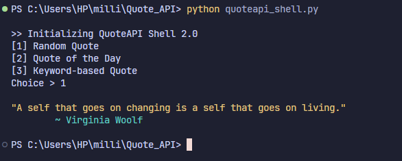
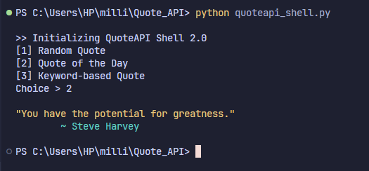
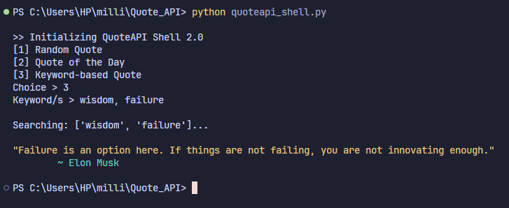

# QuoteAPI Shell — Terminal Quote Fetcher

> A command line quote fetcher with random, daily, and keyword search modes.
> Ask for a quote, filter by keyword, and get an answer printed straight to your terminal — all powered by the ZenQuotes API.

**Simple. Resilient. Terminal-first.**

No accounts. No configuration files. Just a menu and a quote.

[](https://www.python.org/)
[](https://zenquotes.io/)
[](https://docs.python-requests.org/)

---

## What Is This?

QuoteAPI Shell is a lightweight, interactive command-line application for exploring quotes without leaving the terminal. It was built to demonstrate practical handling of external API calls including retries, backoff, and local text filtering wrapped in a simple text-based menu.

Rather than depending on a server-side search feature, keyword matching happens entirely on the client: the full quote list is pulled from the ZenQuotes API once, then filtered locally against whatever keywords the user provides. If a request fails, the app automatically retries with an increasing delay before giving up.

| Function | Responsibility |
|---|---|
| `get_user_choice()` | Displays the menu, validates input, and collects keywords when needed |
| `fetch_quote()` | Routes the request to the correct ZenQuotes endpoint and manages retries |
| `filter_quotes_by_keywords()` | Filters the full quote list against one or more keywords |
| `contains_keyword()` | Checks whether a keyword appears as a whole word in a given text |
| `exponential_backoff_delay()` | Computes the wait time before each retry attempt |
| `main()` | Entry point — ties the menu, fetch, and output together |

---

## Screenshots

### 1 — Random Quote



Selecting option 1 fetches a completely random quote from the ZenQuotes API and prints it to the terminal along with its author. 

---

### 2 — Quote of the Day



Selecting option 2 retrieves the ZenQuotes "quote of the day" — a single featured quote that stays the same for all users until it refreshes the next day.

---

### 3 — Keyword-based Quote



Selecting option 3 prompts the user to enter up to 10 comma-separated keywords. The app searches the full list of available quotes and returns one at random whose text contains at least one of the given keywords. 

---

## Feature List

### Quote Retrieval
- **Random Quote** — Fetches a random quote from the ZenQuotes API.
- **Quote of the Day** — Retrieves the daily featured quote.
- **Keyword-Based Search** — Searches quote text for one or more comma-separated keywords (up to 10) and returns a matching quote at random.
- **Fallback Matching** — If no quote matches all provided keywords, the tool automatically retries with each keyword individually before giving up.

### Reliability
- **Retry with Exponential Backoff** — Automatically retries failed API requests up to 3 times, with increasing delay (2s, 4s, 8s) between attempts.
- **Structured Logging** — Uses Python's `logging` module to report warnings and errors during API calls.

### Terminal Experience
- **Menu-driven Interface** — A simple numbered menu handles input validation and re-prompts on invalid entries.
- **Colored Output** — Displays the returned quote and author using ANSI color codes for readability.

---

## How It Works

1. **Menu → Mode Selection** — `get_user_choice()` displays the menu and returns one of three modes: random, daily, or keyword search.
2. **Mode → API Request** — For random and daily quotes, `fetch_quote()` sends a single request to the corresponding ZenQuotes endpoint.
3. **Keyword Mode → Local Filtering** — For keyword search, the full quote list is retrieved once, then filtered locally by checking whether any supplied keyword appears as a whole word in the quote text.
4. **Failure → Retry** — If a request fails due to a network error or a non-200 response, the app waits using an exponential backoff delay and retries, up to a maximum of 3 attempts.
5. **No Match → Fallback** — If no quote matches all keywords combined, the app falls back to searching for each keyword individually before returning no result.
6. **Result → Terminal Output** — The final quote and author are printed to the terminal in color.

---

## Architecture

```
┌──────────────────────────────────────────────────┐
│              Terminal Menu (main)                 │
│                                                    │
│      [1] Random    [2] Daily    [3] Keyword       │
└─────────────────────────┬─────────────────────────┘
                           │
              ┌────────────▼─────────────┐
              │     get_user_choice()     │
              │  validates input, returns  │
              │   mode + optional keywords │
              └────────────┬─────────────┘
                           │
              ┌────────────▼─────────────┐
              │       fetch_quote()       │
              │  routes to the correct     │
              │   ZenQuotes endpoint       │
              └────────────┬─────────────┘
                           │
          ┌────────────────┴────────────────┐
          │                                 │
┌─────────▼─────────┐            ┌──────────▼──────────┐
│  random / today     │            │    keyword mode      │
│  single GET request  │            │  GET full quote list  │
│                       │            │  + local filtering    │
└─────────┬─────────┘            └──────────┬──────────┘
          │                                 │
          └────────────────┬────────────────┘
                           │
              ┌────────────▼─────────────┐
              │   Retry + Exponential     │
              │   Backoff (on failure)     │
              └────────────┬─────────────┘
                           │
              ┌────────────▼─────────────┐
              │      Terminal Output       │
              │   colored quote + author   │
              └───────────────────────────┘
```

---

## Project Structure

```
quoteapi-shell/
├── Screenshots/         # Example screenshots of the application in use
├── quoteapi_shell.py    # Main application script
└── README.md
```

---

## Installation

### Prerequisites

| Requirement | Notes |
|---|---|
| Python 3.7+ | Uses f-strings; no external framework needed |
| Internet connection | Required to reach the ZenQuotes API |
| `requests` library | Installed via pip — see setup below |

### Setup

```bash
# Clone the repository
git clone https://github.com/millixs/Quote_API.git
cd Quote_API

# Install the required dependency
pip install requests
```

---

## Usage

Run the script from the terminal:

```bash
python quoteapi_shell.py
```

You will be presented with a menu:

```
>> Initializing QuoteAPI Shell 2.0
[1] Random Quote
[2] Quote of the Day
[3] Keyword-based Quote
Choice >
```

### Basic workflow

1. Choose `1`, `2`, or `3` from the menu.
2. If you chose `3`, enter one or more comma-separated keywords when prompted.
3. The app fetches and, if needed, filters the quote list — retrying automatically on failure.
4. The matching quote and author are printed to the terminal in color.
5. Enter `0` at any time to exit the program.

---

## Tech Stack

| Layer | Technology | Role |
|---|---|---|
| **Language** | Python 3.7+ | Core application logic |
| **HTTP Client** | `requests` | Sends GET requests to the ZenQuotes API |
| **API** | ZenQuotes API | Source of quote data (random, daily, full list) |
| **Logging** | `logging` (stdlib) | Reports warnings and errors during API calls |
| **Retry Strategy** | Custom exponential backoff | Handles transient network and API failures |
| **Output Formatting** | ANSI escape codes | Colored terminal output |

---

*"Few lines of Python. Endless words of wisdom."*
